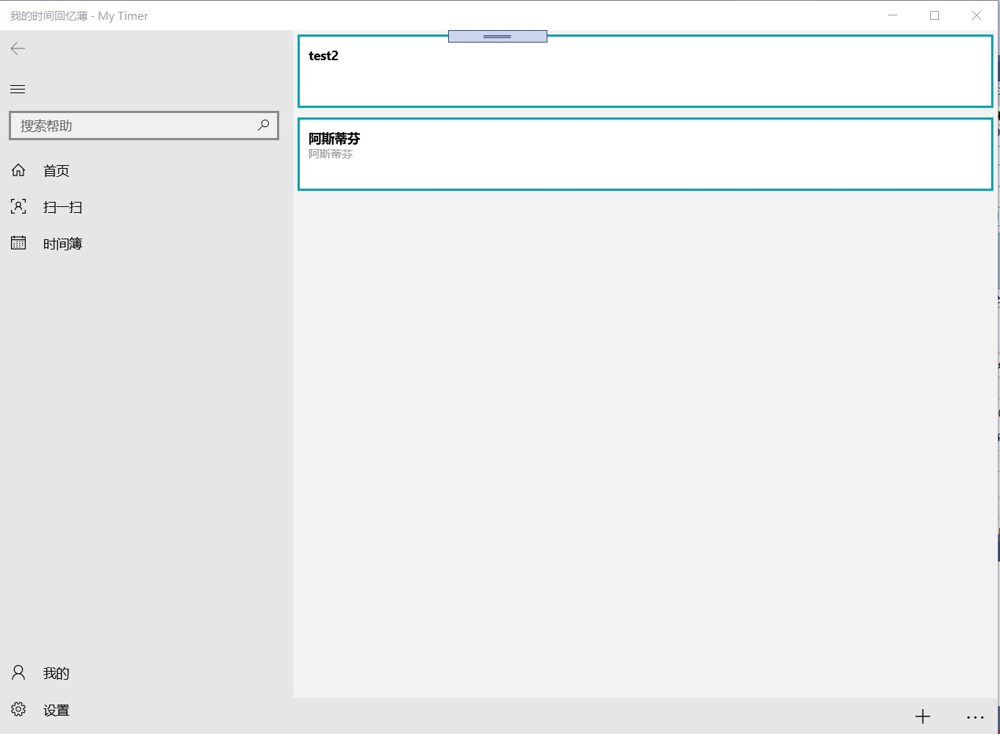
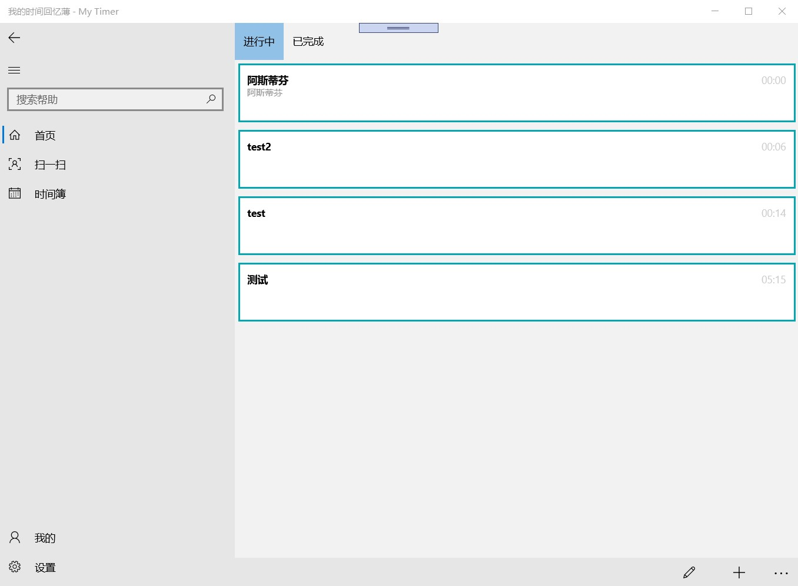
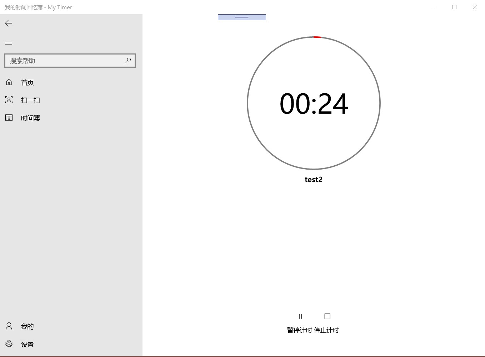
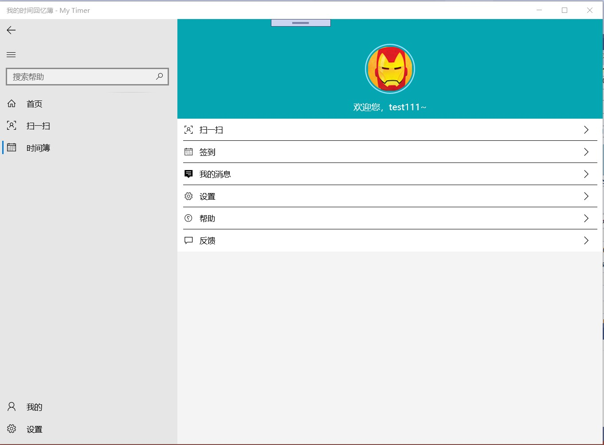
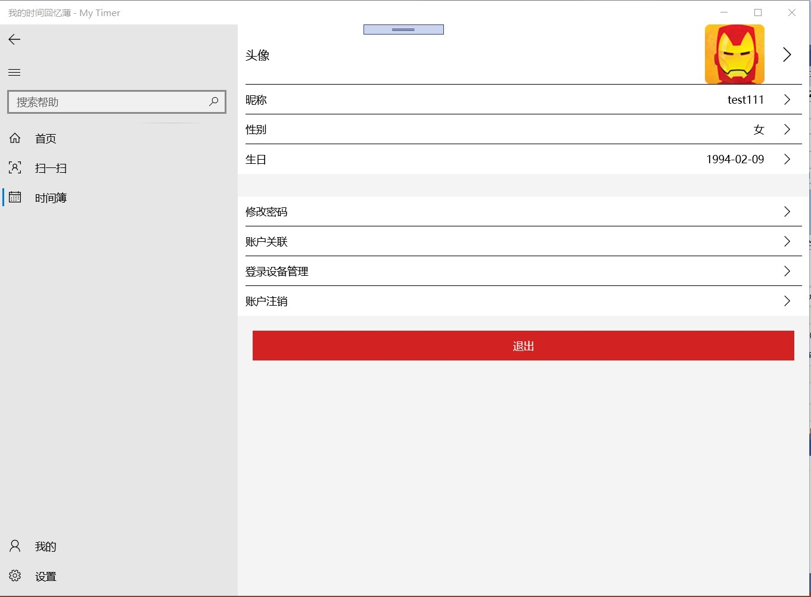

# UWP-Timer
 
 一个计时任务管理客户端，调整为基于winui3

 [Mini-Timer](https://github.com/zx648383079/Mini-Timer) 的UWP版

 体验【[Win10 UWP](https://www.microsoft.com/store/apps/9MT2DR6PDFG9)】

 ## 预览图

 
 
 
 
 

 ## 使用

 请配置信息

`UWP-Timer\Repositories\Constants.cs`

```c#
public const string ApiEndpoint = ""; // api 入口
public const string AppId = "<APP ID>"; // api 验证用的 appid
public const string Secret = "<APP SECRET>"; // api 验证用的 app secret
```

## 功能

番茄时间

任务分享、及评论

文章博客

微型博客

消息

扫码

签到

接受分享

支持协议打开